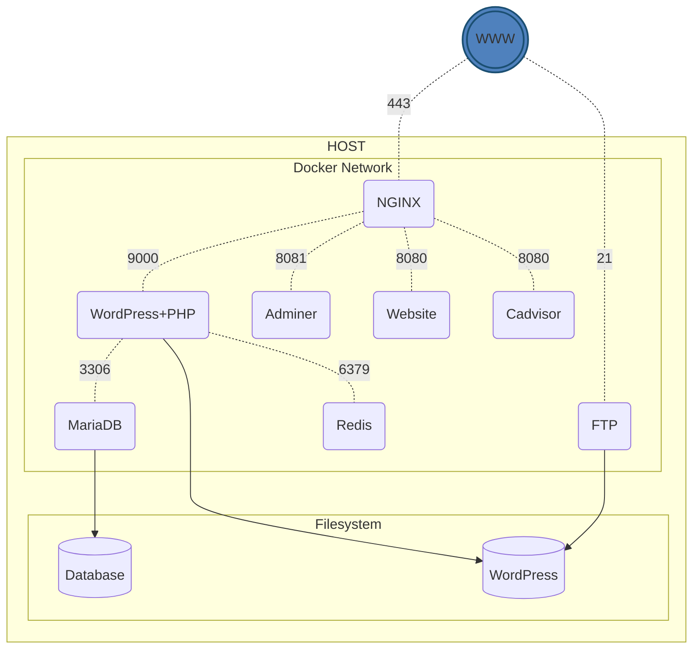

# Inception
> A Docker infrastructure project for 42 School

## 🌎 Language / Idioma
[🇧🇷 Ver em Português](README_pt-br.md)

## 📋 About the Project

This project is part of the 42 School curriculum and aims to broaden knowledge of system administration using Docker. The goal is to virtualize several Docker images in a personal virtual machine, setting up a small infrastructure composed of different services under specific rules.

The infrastructure implements the following requirements:

- Docker containers for:
  - **NGINX** with TLSv1.2/TLSv1.3
  - **WordPress + php-fpm**
  - **MariaDB**
- Volumes for:
  - WordPress database
  - WordPress website files
- A Docker network to establish connection between containers

## 🏗️ Architecture

```
                  ┌─────────┐
                  │   WWW   │
                  └────┬────┘
                       │
                   port 443
                       │
                       ▼
┌─────────────────Docker Network──────────────────┐
│                                                 │
│  ┌─────────┐       ┌─────────┐      ┌────────┐  │
│  │  NGINX  │──9000→│WordPress│─3306→│MariaDB │  │
│  └─────────┘       │  +PHP   │      └────┬───┘  │
│       │            └────┬────┘           │      │
│       │                 │                │      │
│       │                 │                │      │
│       ▼                 ▼                ▼      │
│  ┌──────────────────Volumes───────────────────┐ │
│  │                                            │ │
│  │            ┌───────────┐ ┌───────────┐     │ │
│  │            │WordPress  │ │Database   │     │ │
│  │            │  Files    │ │           │     │ │
│  │            └───────────┘ └───────────┘     │ │
│  │                                            │ │
│  └────────────────────────────────────────────┘ │
│                                                 │
└─────────────────────────────────────────────────┘
```

## 🚀 Bonus Features

In addition to the main requirements, the project includes the following bonus features:

- **Redis Cache**: To improve WordPress performance
- **FTP Server**: Pointing to the WordPress volume
- **Static Website**: Developed in Go (not in PHP)
- **Adminer**: Database management interface
- **cAdvisor**: Container resource monitoring

**Architecture with Bonus Features:**



## 🛠 Technologies Used

- **Docker and Docker Compose**: Container virtualization and orchestration
- **Alpine/Debian**: Base images for containers
- **NGINX**: Web server with HTTPS support
- **MariaDB**: Database management system
- **WordPress and PHP-FPM**: CMS and PHP processor
- **Redis**: In-memory cache system
- **Go**: Language for the static website
- **VSFTPD**: FTP server
- **Adminer**: Web-based database manager
- **cAdvisor**: Container resource monitoring

## 🔧 How to Use

### Requirements

- Linux or macOS
- Docker and Docker Compose installed
- Sudo permissions

### Setup

1. Clone the repository:
   ```bash
   git clone https://github.com/magalhaesm/inception.git
   cd inception
   ```

2. Configure the environment file:
   ```bash
   cp srcs/.env.example srcs/.env
   # Edit the .env file as needed
   ```

3. Add an entry to your `/etc/hosts` file:
   ```
   127.0.0.1 your-login.42.fr website.your-login.42.fr cadvisor.your-login.42.fr
   ```

### Commands

The Makefile provides several useful commands:

```bash
# Start all services
make up

# Stop all services
make down

# Start existing services
make start

# Stop services without removing them
make stop

# Access a container's shell
make shell

# Check container status
make ps

# View container logs
make logs

# Remove all containers and images
make clean

# Remove containers, images, and volumes
make fclean

# Clean up the entire Docker environment (including volumes)
make prune
```

## 📦 Project Structure

```
inception/
├── Makefile            # Scripts to manage the project
├── srcs/
│   ├── .env            # Environment variables
│   ├── docker-compose.yml
│   └── requirements/
│       ├── mariadb/
│       │   ├── conf/
│       │   ├── Dockerfile
│       │   └── tools/
│       ├── nginx/
│       │   ├── conf/
│       │   └── Dockerfile
│       ├── wordpress/
│       │   ├── Dockerfile
│       │   └── tools/
│       └── bonus/
│           ├── adminer/
│           ├── cadvisor/
│           ├── ftp/
│           ├── redis/
│           └── website/
```

## 🔐 Security

- NGINX configured with TLSv1.2 and TLSv1.3 only
- Environment variables for passwords and sensitive data
- Secure communication between containers via Docker network

## 📝 Notes

- Containers restart automatically in case of failure
- Infrastructure access is exclusively through HTTPS (port 443)
- Passwords and credentials are configured through environment variables

## 📄 License

This project is under the MIT License. See the [LICENSE](LICENSE) file for more details.
