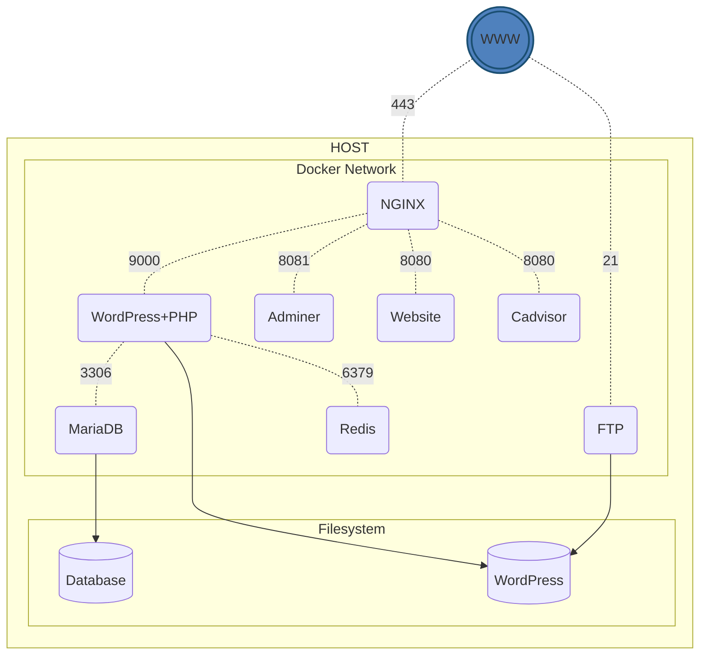

# inception

```mermaid
%%{ init: { 'graph': { 'curve': 'monotoneX' } } }%%
graph TD
    Web(((WWW)))
    subgraph HOST
        subgraph Docker Network
            C1(MariaDB)
            C2(WordPress+PHP)
            C3(NGINX)
            C4(FTP)
            C5(Adminer)
            C6(Website)
            C7(Cadvisor)
            C8(Redis)
        end
        subgraph Filesystem
            DB[(Database)]
            WP[(WordPress)]
        end
    end

Web -. 21 .- C4
Web -. 443 .- C3
C3 -. 9000 .- C2
C3 -. 8080 .- C6
C3 -. 8080 .- C7
C3 -. 8081 .- C5
C2 -. 3306 .- C1
C2 -. 6379 .- C8
C1 --> DB
C2 & C4 --> WP

style Web fill:#4F81BD,stroke:#1B4F72,stroke-width:2px
```
