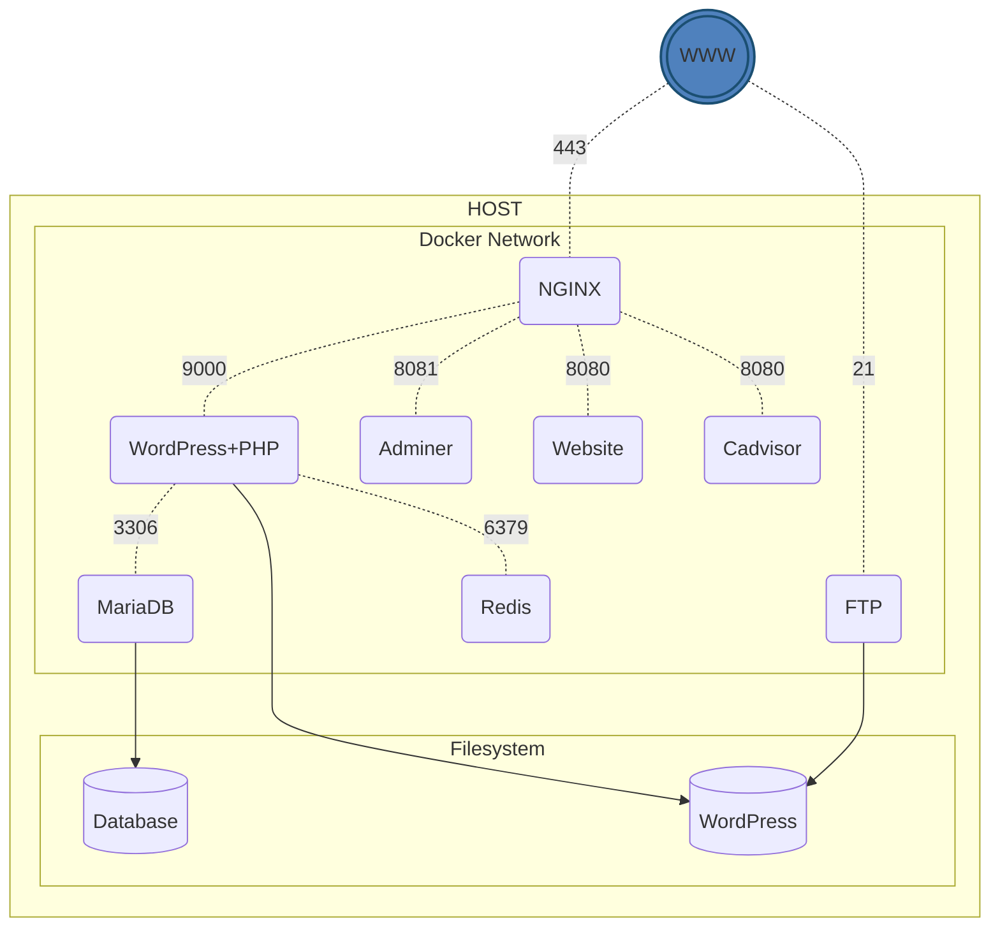

# Inception
> Um projeto de infraestrutura Docker para a Escola 42

## 🌎 Idioma / Language
[🇺🇸 View in English](README.md)

## 📋 Sobre o Projeto

Este projeto faz parte do currículo da Escola 42 São Paulo e visa ampliar o conhecimento de administração de sistemas usando Docker. O objetivo é virtualizar várias imagens Docker em uma máquina virtual pessoal, configurando uma pequena infraestrutura composta por diferentes serviços sob regras específicas.

A infraestrutura implementa os seguintes requisitos:

- Containers Docker para:
  - **NGINX** com TLSv1.2/TLSv1.3
  - **WordPress + php-fpm**
  - **MariaDB**
- Volumes para:
  - Banco de dados WordPress
  - Arquivos do site WordPress
- Uma rede Docker para estabelecer conexão entre os containers

## 🏗️ Arquitetura

```
                  ┌─────────┐
                  │   WWW   │
                  └────┬────┘
                       │
                   porta 443
                       │
                       ▼
┌─────────────────Rede Docker──────────────────────┐
│                                                  │
│  ┌─────────┐       ┌─────────┐      ┌────────┐   │
│  │  NGINX  │──9000→│WordPress│─3306→│MariaDB │   │
│  └─────────┘       │  +PHP   │      └────┬───┘   │
│       │            └────┬────┘           │       │
│       │                 │                │       │
│       │                 │                │       │
│       ▼                 ▼                ▼       │
│  ┌──────────────────Volumes───────────────────┐  │
│  │                                            │  │
│  │            ┌───────────┐ ┌───────────┐     │  │
│  │            │WordPress  │ │Database   │     │  │
│  │            │  Files    │ │           │     │  │
│  │            └───────────┘ └───────────┘     │  │
│  │                                            │  │
│  └────────────────────────────────────────────┘  │
│                                                  │
└──────────────────────────────────────────────────┘
```

## 🚀 Recursos Bônus

Além dos requisitos principais, o projeto inclui os seguintes bônus:

- **Redis Cache**: Para melhorar o desempenho do WordPress
- **Servidor FTP**: Apontando para o volume do WordPress
- **Site Estático**: Desenvolvido em Go (não em PHP)
- **Adminer**: Interface para gerenciamento do banco de dados
- **cAdvisor**: Monitoramento de recursos dos containers

**Arquitetura com os Bônus:**



## 🛠 Tecnologias Utilizadas

- **Docker e Docker Compose**: Virtualização e orquestração de containers
- **Alpine/Debian**: Imagens base para os containers
- **NGINX**: Servidor web com suporte a HTTPS
- **MariaDB**: Sistema de gerenciamento de banco de dados
- **WordPress e PHP-FPM**: CMS e processador PHP
- **Redis**: Sistema de cache em memória
- **Go**: Linguagem para o site estático
- **VSFTPD**: Servidor FTP
- **Adminer**: Gerenciador de banco de dados via web
- **cAdvisor**: Monitoramento de recursos dos containers

## 🔧 Como Usar

### Requisitos

- Linux ou macOS
- Docker e Docker Compose instalados
- Permissões de sudo

### Configuração

1. Clone o repositório:
   ```bash
   git clone https://github.com/magalhaesm/inception.git
   cd inception
   ```

2. Configure o arquivo de ambiente:
   ```bash
   cp srcs/.env.example srcs/.env
   # Edite o arquivo .env conforme necessário
   ```

3. Adicione uma entrada ao seu arquivo `/etc/hosts`:
   ```
   127.0.0.1 seu-login.42.fr website.seu-login.42.fr cadvisor.seu-login.42.fr
   ```

### Comandos

O Makefile fornece diversos comandos úteis:

```bash
# Iniciar todos os serviços
make up

# Parar todos os serviços
make down

# Iniciar serviços existentes
make start

# Parar serviços sem removê-los
make stop

# Acessar o shell de um container específico
make shell

# Verificar o status dos containers
make ps

# Ver logs dos containers
make logs

# Remover todos os containers e imagens
make clean

# Remover containers, imagens e volumes
make fclean

# Limpar todo o ambiente Docker (incluindo volumes)
make prune
```

## 📦 Estrutura do Projeto

```
inception/
├── Makefile            # Scripts para gerenciar o projeto
├── srcs/
│   ├── .env            # Variáveis de ambiente
│   ├── docker-compose.yml
│   └── requirements/
│       ├── mariadb/
│       │   ├── conf/
│       │   ├── Dockerfile
│       │   └── tools/
│       ├── nginx/
│       │   ├── conf/
│       │   └── Dockerfile
│       ├── wordpress/
│       │   ├── Dockerfile
│       │   └── tools/
│       └── bonus/
│           ├── adminer/
│           ├── cadvisor/
│           ├── ftp/
│           ├── redis/
│           └── website/
```

## 🔐 Segurança

- NGINX configurado apenas com TLSv1.2 e TLSv1.3
- Variáveis de ambiente para senhas e dados sensíveis
- Comunicação segura entre containers via rede Docker

## 📝 Notas

- Os containers são reiniciados automaticamente em caso de falha
- O acesso à infraestrutura é feito exclusivamente via HTTPS (porta 443)
- As senhas e credenciais são configuradas através de variáveis de ambiente

## 📄 Licença

Este projeto está sob a licença MIT. Veja o arquivo [LICENSE](LICENSE) para mais detalhes.
